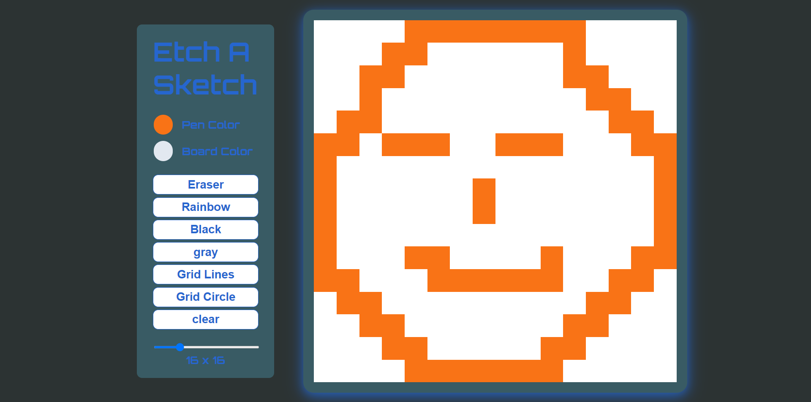

# etch-a-sketch
A browser version of something between a sketchpad and an Etch-A-Sketch.

Solution for the [PROJECT: ETCH-A-SKETCH](https://www.theodinproject.com/paths/foundations/courses/foundations/lessons/etch-a-sketch-project) from the [Foundations](https://www.theodinproject.com/paths/foundations/courses/foundations) part of [The Odin Project](https://www.theodinproject.com/).

## Table of contents
- [Overview](#overview)
  - [Requirement](#project-requirement)
  - [Solution Screenshot](#solution-screenshot)
  - [Links](#links)
- [My process](#my-process)
  - [Built with](#built-with)
  - [What I learned](#what-i-learned)
- [Author](#author)

### Project-Requirement
A sketch pad where user can draw, and customize the sketch pad.

### Solution Screenshot
The final output:

### Links
Live Site URL: [Live site of the challenge hosted here](#)

## My process
Hello, this is my 4th project here in The Odin Project. It's a browser version of something between a sketchpad and an Etch-A-Sketch. It was a little challenging at first but finally I made it. At first the cod was messy later I have refactored the code and reduced redundancy.

### Built with
- HTML5
- CSS
- Grid
- Javascript
- DOM

### What I learned
- I've learned a lot about cleaning and refactoring code in this project.

## Author
- Website - Well I haven't made my profile portfolio yet, gonna make it sooon when I know a lot of stuffs
- LinkedIn - [@mainul islam](https://www.linkedin.com/in/mainul-islam-nirob/)
- Frontend Mentor - [@mainul](https://www.frontendmentor.io/profile/Mainul-Islam-Nirob)
- Twitter - [@mainul](https://twitter.com/Mainuli96601040)
- FreeCodeCamp - [@mainul](https://www.freecodecamp.org/mainul)
